# Computer_Networks_B-C
Client Server Application of the traditional Bulls and Cows Game

## Tools and Languages Used :
<p>


</p>

## Download and Usage :
The code can be downloaded as a compressed `zip` file from the github web interface.

The repository can also be cloned using:
```
git clone https://github.com/BarathKumarBK-15/Computer_Networks_B-C.git
```

The game server can be deployed locally after extraction by compiling and running the `bcserver.c` file using the sequence of code in the terminal:
```
gcc bcserver.c -o bcserver
```
```
./bcserver
```

The game can be deployed locally after extraction by compiling and running the `bcgame.c` file using the sequence of code in the terminal:
```
gcc bcgame.c -o bcgame
```
```
./bcgame
```

## Screen Shots
### Server

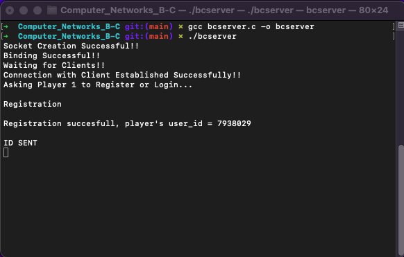

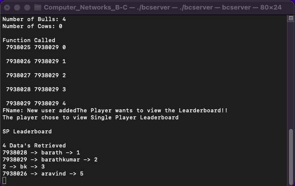
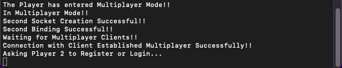

### Player 1
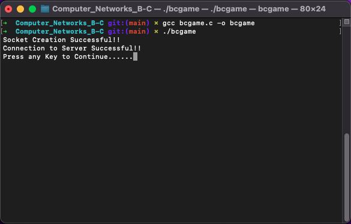
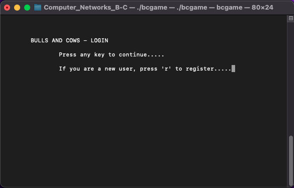
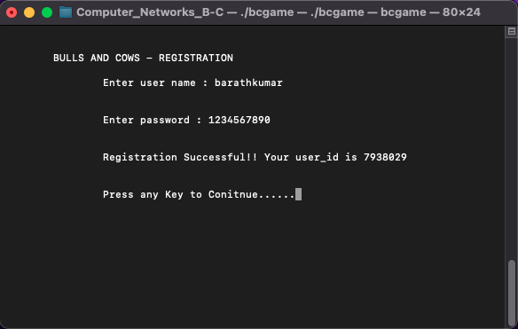
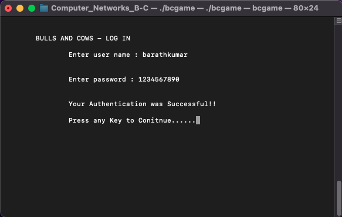
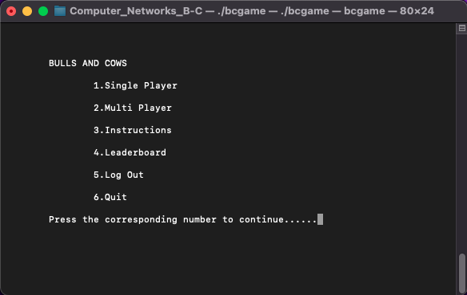
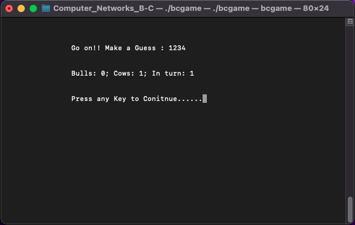
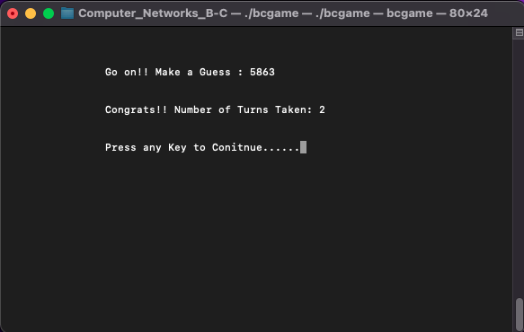
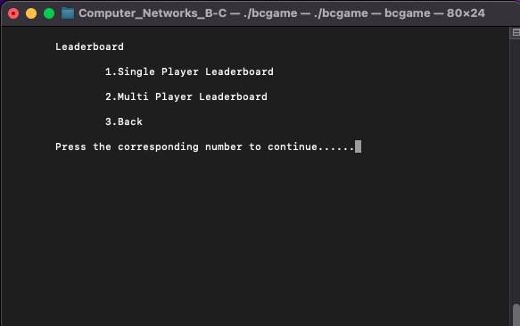
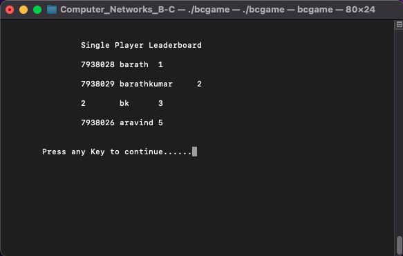
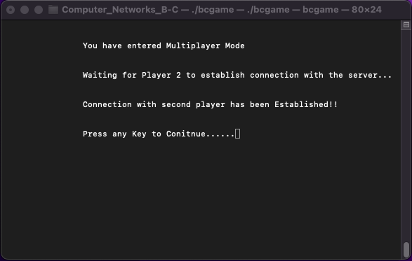
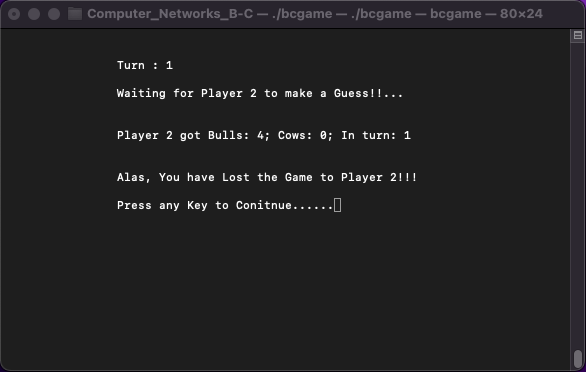
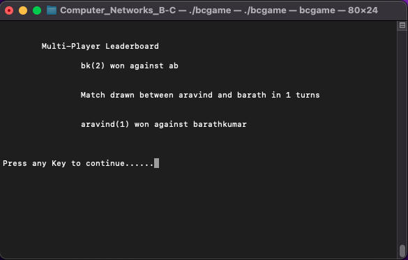

### Player 2

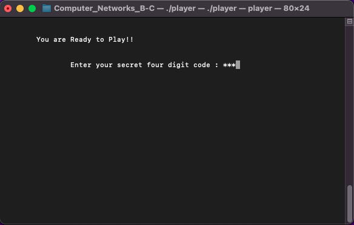
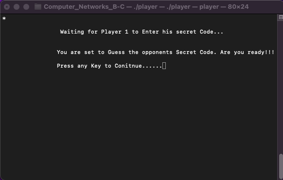
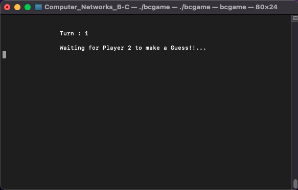

## Components of Project :
- **C** files - 2

**Note** : 
The game has been further developed using `HTML5`, `CSS3` and `JavaScript` with a better graphical model and an interactive user-friendly layout. Click on the link below for more details.

Project Link: https://github.com/beekayg15/BullsandCowsWebPage

Game Link: https://beekayg15.github.io/BullsandCowsWebPage

## Contributors
- <a href="https://github.com/Aravindkrish25"> Aravind M </a>
- <a href="https://github.com/BarathKumarBK-15"> Barath Kumar G </a>
- <a href="https://github.com/Bhooshaan"> Bhooshaan A </a>
- <a href="https://github.com/Hrithik1702"> Hrithik B </a> 
